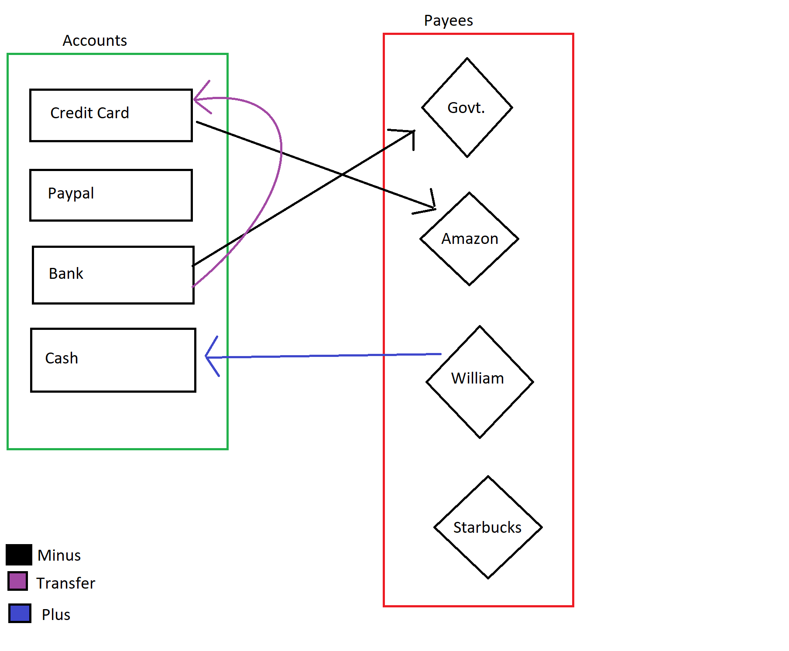

# homeFinance

This is the homepage of a homegrown finance app for home finances, meant for all open-source & homely homies homing about in a quest for a tool to manage their finances. :)

### Why should I use this app?
I am very glad you asked. Really. Well, there are tons of reasons. Here are some of the good ones:

1. **Feel like a techie, sudo style!** This app is very clunky and unnatural. It has the console open in the background and requires you to click the buttons rather than tab-enter, very cryptic usage pattern, weird old looking UI, along with forcing some options to be answered on the console. Only the coolest programmers use such apps. :)
2. **Support Education**. If you star this, or download this, contribute to this, or simply use this, at least one person shall be inspired to learn more about the stuff involved in the programming of this app, and in general educate himself (me). That is a very noble task, meant only for truly noble men/women like you. 
3. **Be a part of bleeding edge software**. Tons of bugs, seriously required UI improvements, unlimited scope for improvement, cool but pointless integrations like cryptography support and an active developer - all the hallmarks of a bleeding edge software.
4. **Spread Smile(s) and reduce plastic**. Guaranteed one smile per star/download/contribution. Make the world a happier place. Also, developer guarantees recycling at least 1 bottle per download/star/contribution.
5. **Learn patience, planning for technical contingencies (what if you lose the data), perseverence and meticulousness**. All of these are essential life skills, and the app is created to inculcate these in young men/women of this very value-less era.
6. **You (the user) don't care about home finances in reality as much as you care about pretending to care**. Perfect app for this purpose. Any one wanting to double check if your maintained database is actually good/consistent/honest will give up after getting a feel of the app. Highly secure wool over their eyes.
7. **This developer has actually taken pains and written all this? I should at least see his app.** Yes, you should. Definitely.

### Bad reasons to use this app
1. **To rely solely on this app for home financial management** Kind of obvious. Why would anyone rely on a home-finance app to do their home finances anyway?
2. **Tax returns** No. Please not the t-word.
3. **Extremely secret alien finances** Although the cryptography is definitely unbreakable (duh), I actually don't have much idea what I'm doing. So I would rather let the aliens do their work themselves or use an alternative app.

### Explanation of the financial model
This program uses a weird but hopefully intuitive system (inspired from other Money Management Apps). Every transaction has 4 important descriptors. First, is the **"From"** section, which is one of the *Accounts* (Coming ahead). Next is the **To** section which is either a *Payee* or an *Account*. Next is a **Category** and the final is the **Type**, which is one of the three (*Transfer*, *Minus*, *Plus*).

All the assets and money accounts are modelled under *Accounts*. One would ideally have a Bank Account, Credit Card account, Cash Account and online wallets/cryptocurrency wallets as a part of his/her *Accounts* list. If you total the balance of these Accounts, you would get the current total wealth of the person, the sum total of their money. If you shuttle money between these accounts, (Example: Paying the Credit Card bill is Money goes from Bank Account to Credit Card Account), the **Type** *Transfer* is used for the transaction.

*Payees* are the entities which one would deal with financially, either paying money to or getting money from. If one pays moeny to a payee, the transaction **Type** is *Minus*, and it goes from one account to a payee. If one is paid some money, the **From** and **To** fields are still an account and a payee respectively, but the **Type** changes to *Plus*.

*Categories* are just a way to classify transactions. Each transaction can be labelled with a category irrespective of all other fields. For example, a *transfer* modelling the payment of Credit Card Bills can be labelled with a category "bills". A *Minus* transaction from Paypal to Amazon to buy a phone can be labelled with the category "electronics", and so on.

There is no standard way to model your finances. This is just a rough guide. Feel free to create whatever system suits you the best.

### Description of the app
To run this app, navigate to the folder containing the script files and enter in the console `python homeFinance.py <dbname>` with a `<dbname>` if you want to open an already existing databse or without that to create a new database. It will ask for the password and if successful, will open the GUI in the former case, or will prompt for the name of the new database in the latter case. Either way, you need to be replying in console.

There are currently 3 tabs in the GUI. The first one is to add new accounts (currently start with zero opening balance. You might need a pseudo past-dated transaction to add balance), payees, categories or add a new transaction. The options are self explanatory and the submit buitton provides feedback if the transaction was successfully added or if the entered data failed to validate (date or the amount). You can also delete accounts/payees/categories but that will not remove the transactions and the only way to view them in the viewer is to select all the columns in all the lists. 

Nest is the viewer. It allows filtering based on what all is selected. Press refresh to load. Select everything to display all transactions. Only the transactions within the date range will be shown.

Last is the Numeric Analysis tab. Displays almost evrything you might want to know as a summary of transactions within a date range. Opening balance refers to the sum total of the transactions happening before the starting date of the analysis range.

On quitting the option of saving shall come up in the console. Please do not skip this. Press 'y' and enter to save. Will require your password (I do not know why this feature is there. Seemed cool when I added it. ).

### Upcoming Features
#### Definitely Upcoming
0. (0-indexed, as it should be) Code cleanup for readability
1. Graphical Analysis tab
2. Export databse as csv
3. Change Password
4. Save button in the UI and auto-save
5. Support for adding opening balance when adding a new Account
#### Maybe upcoming
0. Import database data
1. Delete transactions
2. Budget setup and compare
3. Different currencies
4. UI-based password entry

### Requirements (apart from Python 3.x)
1. [Cryptography](https://pypi.org/project/cryptography/) (Cool Stuff, I know)
2. [Pandas](https://pypi.org/project/pandas/)
3. [Numpy](https://pypi.org/project/numpy/)
4. base64, os, sys, tkinter, time, getpass (Usually included as the standard python library)
